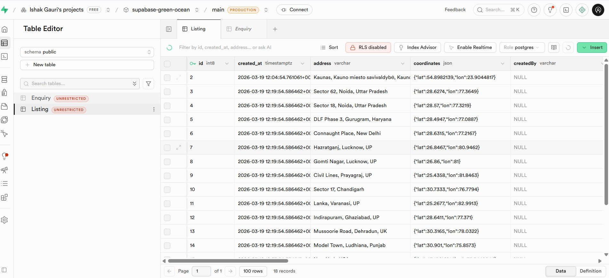
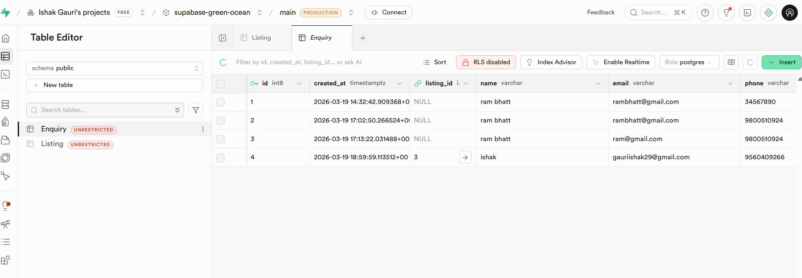
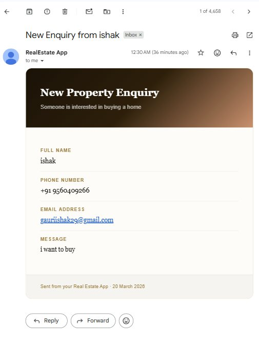
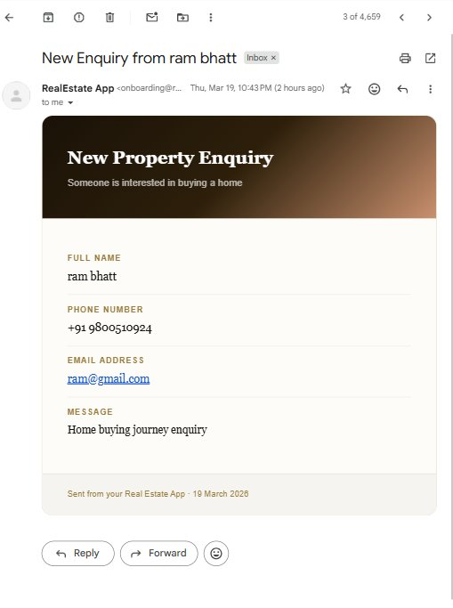

# 🏠 Real Estate App

A modern, full-stack real estate listing platform built with **Next.js 14**, **Supabase**, **Clerk Auth**, **LocationIQ Maps**, and **Resend Email**. Users can browse property listings, view detailed property pages with live maps, and send inquiries that trigger real transactional emails.

---

## 🌐 Live Demo

> _Add your Vercel/deployment URL here_

---

## 📸 Screenshots

> _Add UI screenshots of your listing page and detail page here_

---

## 📁 Project Structure

```
real-state-app/
├── app/                    # Next.js 14 App Router pages & layouts
├── components/             # Reusable UI components (cards, forms, maps)
├── clerk-nextjs/           # Clerk authentication helpers
├── lib/                    # Supabase client, utility functions
├── utils/                  # Helper functions (formatting, geocoding, etc.)
├── public/                 # Static assets
├── middleware.ts           # Clerk auth middleware (route protection)
├── next.config.mjs         # Next.js configuration
├── .env.local              # Environment variables (not committed)
└── README.md
```

---

## ⚙️ Tech Stack

| Layer | Technology |
|---|---|
| **Frontend** | Next.js 14 (App Router), Tailwind CSS, shadcn/ui |
| **Authentication** | [Clerk](https://clerk.com) |
| **Database & Storage** | [Supabase](https://supabase.com) (PostgreSQL + Storage Buckets) |
| **Maps** | [LocationIQ](https://locationiq.com) (Geocoding + Map Tiles) |
| **Email** | [Resend](https://resend.com) (Transactional Emails) |
| **Deployment** | Vercel |

---

## 🗂️ Database Schema

The database is hosted on **Supabase** (PostgreSQL). There are 2 tables with a one-to-many relationship.

### Entity Relationship Diagram

```
┌──────────────────────────────┐         ┌────────────────────────────┐
│           Listing            │         │          Enquiry            │
├──────────────────────────────┤         ├────────────────────────────┤
│ id          BIGINT  PK       │◄────────│ id          BIGINT  PK     │
│ created_at  TIMESTAMPTZ      │  1 : N  │ created_at  TIMESTAMPTZ    │
│ address     VARCHAR          │         │ listing_id  BIGINT  FK     │
│ coordinates JSON             │         │ name        VARCHAR         │
│ city        VARCHAR          │         │ email       VARCHAR         │
│ createdBy   VARCHAR          │         │ phone       VARCHAR         │
│ active      BOOLEAN          │         │ message     TEXT            │
│ Property_type VARCHAR[]      │         └────────────────────────────┘
│ listingType VARCHAR          │
│ Floor_plan  VARCHAR          │
│ bedroom     INTEGER          │
│ bathroom    INTEGER          │
│ builtIn     VARCHAR          │
│ parking     INTEGER          │
│ lotSize     NUMERIC          │
│ area        NUMERIC          │
│ price       NUMERIC          │
│ hoa         NUMERIC          │
│ description TEXT             │
│ images      TEXT[]           │
└──────────────────────────────┘
```

**Relationship:** One `Listing` can receive **many** `Enquiry` rows via `listing_id` (Foreign Key).

---

### DDL — `Listing` Table

```sql
CREATE TABLE public."Listing" (
    id               BIGINT                   GENERATED BY DEFAULT AS IDENTITY NOT NULL,
    created_at       TIMESTAMP WITH TIME ZONE NOT NULL DEFAULT NOW(),
    address          CHARACTER VARYING        NULL,
    coordinates      JSON                     NULL,    -- { "lat": 28.6139, "lng": 77.2090 }
    city             CHARACTER VARYING        NULL,
    "createdBy"      CHARACTER VARYING        NULL,    -- Clerk user_id
    active           BOOLEAN                  NOT NULL DEFAULT FALSE,
    "Property_type"  CHARACTER VARYING[]      NULL,    -- e.g. ARRAY['Apartment', 'Villa']
    "listingType"    CHARACTER VARYING        NULL,    -- 'sale' | 'rent'
    "Floor_plan"     CHARACTER VARYING        NULL,
    bedroom          INTEGER                  NULL,
    bathroom         INTEGER                  NULL,
    "builtIn"        CHARACTER VARYING        NULL,
    parking          INTEGER                  NULL,
    "lotSize"        NUMERIC                  NULL,
    area             NUMERIC                  NULL,
    price            NUMERIC                  NULL,
    hoa              NUMERIC                  NULL,
    description      TEXT                     NULL,
    images           TEXT[]                   NULL,    -- Supabase Storage URLs
    CONSTRAINT "Listing_pkey" PRIMARY KEY (id)
) TABLESPACE pg_default;
```

### DDL — `Enquiry` Table

```sql
CREATE TABLE public."Enquiry" (
    id           BIGINT                   GENERATED BY DEFAULT AS IDENTITY NOT NULL,
    created_at   TIMESTAMP WITH TIME ZONE NOT NULL DEFAULT NOW(),
    listing_id   BIGINT                   NULL,
    name         CHARACTER VARYING        NULL,
    email        CHARACTER VARYING        NULL,
    phone        CHARACTER VARYING        NULL,
    message      TEXT                     NULL,
    CONSTRAINT enquiry_pkey PRIMARY KEY (id),
    CONSTRAINT "Enquiry_listing_id_fkey"
        FOREIGN KEY (listing_id) REFERENCES public."Listing" (id)
) TABLESPACE pg_default;
```

> 📄 Full DDL with indexes: [`real_estate_schema.sql`](./real_estate_schema.sql)

---

### 📊 Supabase Tables (Live Data)

**`Listing` table** — 18 property records with real geocoded coordinates from LocationIQ:



**`Enquiry` table** — Inquiry records with FK relationship to listings:



---

## 🔌 External Services & Integration Map

| Service | Purpose | Where it's used in DB |
|---|---|---|
| **Clerk** | User authentication & session management | `Listing."createdBy"` stores the Clerk `user_id` |
| **Supabase** | PostgreSQL DB + file storage buckets | All tables; `Listing.images[]` = Storage URLs |
| **LocationIQ** | Geocoding addresses → lat/lng + map tiles | `Listing.coordinates` JSON `{ lat, lng }` |
| **Resend** | Transactional email on new inquiry | Triggered on `Enquiry` table insert |

---

## 📧 Email Notifications (Resend)

When a user submits the **"Send Inquiry"** form on any property detail page, a transactional email is fired via the Resend API to the listing agent.

**Email received in inbox (live proof):**





---

## 🚀 Getting Started

### Prerequisites

- Node.js 18+
- A [Supabase](https://supabase.com) project
- A [Clerk](https://clerk.com) application
- A [LocationIQ](https://locationiq.com) API key
- A [Resend](https://resend.com) API key

### 1. Clone the repository

```bash
git clone https://github.com/your-username/real-state-app.git
cd real-state-app
```

### 2. Install dependencies

```bash
npm install
```

### 3. Configure environment variables

Create a `.env.local` file in the root:

```env
# Clerk Authentication
NEXT_PUBLIC_CLERK_PUBLISHABLE_KEY=pk_test_...
CLERK_SECRET_KEY=sk_test_...
NEXT_PUBLIC_CLERK_SIGN_IN_URL=/sign-in
NEXT_PUBLIC_CLERK_SIGN_UP_URL=/sign-up

# Supabase
NEXT_PUBLIC_SUPABASE_URL=https://your-project.supabase.co
NEXT_PUBLIC_SUPABASE_ANON_KEY=your-anon-key

# LocationIQ
NEXT_PUBLIC_LOCATIONIQ_KEY=your-locationiq-key

# Resend Email
RESEND_API_KEY=re_...
```

### 4. Set up the database

Run the DDL in your Supabase SQL editor:

```bash
# Copy the contents of real_estate_schema.sql and run in Supabase SQL Editor
```

Or paste [`real_estate_schema.sql`](./real_estate_schema.sql) directly into your Supabase **SQL Editor**.

### 5. Run the development server

```bash
npm run dev
```

Open [http://localhost:3000](http://localhost:3000)

---

## ✅ Features

- 🔐 **Authentication** — Sign up / Sign in with Clerk (email + social login)
- 🏘️ **Property Listing Page** — Browse all active listings with filters by type, city, price
- 🏡 **Property Detail View** — Full description, amenities, image gallery
- 🗺️ **Live Map** — LocationIQ map with pin at the property's geocoded coordinates
- 📩 **Send Inquiry Form** — Contact form that emails the agent via Resend
- 📦 **Image Upload** — Property images stored in Supabase Storage buckets
- 🔒 **Protected Routes** — Middleware protects agent/admin routes via Clerk

---

## 📦 Deliverables Summary

| Deliverable | Status |
|---|---|
| Frontend UI (Next.js + Tailwind) |  Complete |
| Database Schema (DDL + ERD) | Complete — see `real_estate_schema.sql` |
| Backend API (BaaS — Clerk + Supabase + Resend) | Complete |
| Property Listing Page | Complete |
| Property Detail View with Map | Complete |
| Send Inquiry Form + Email | Complete |

---

## 👤 Author

**Ishak Gauri**  
Assignment 2 — Real Estate App  
Built with Next.js 14 · Supabase · Clerk · LocationIQ · Resend